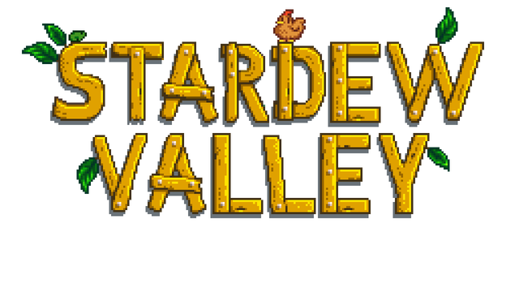
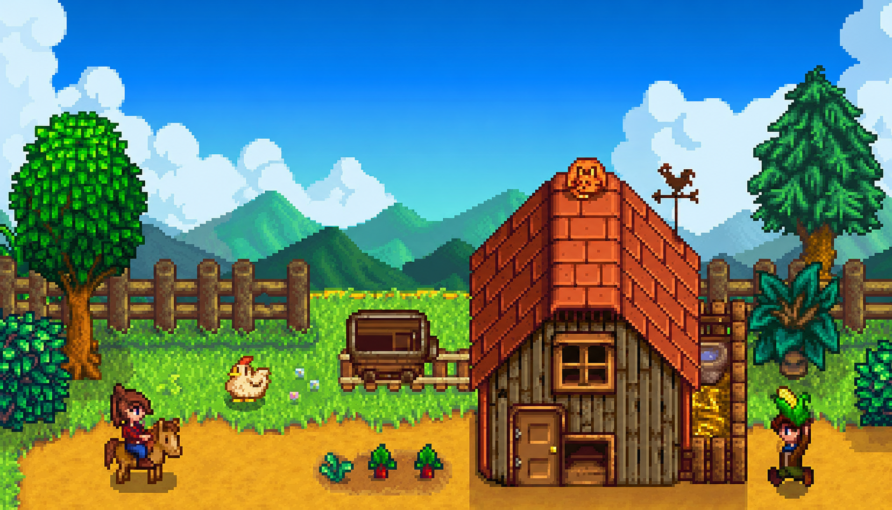

 

  

 

### [ ⬇️ &nbsp; DESCARGAR LAUNCHER &nbsp; ⬇️ ](https://github.com/Seguaz/stardew-chistositos/releases/latest)

---

## 🌾 ¿Qué es esto?

El launcher de nuestra **granja co-op modeada** de Stardew Valley. Te quita todo el lío:

- 🔄 **Sincroniza los mods solos** con el servidor (no más "a mí me va distinto").
- 🚪 **Entras directo a tu cabaña** al pulsar Jugar (sin menús ni elegir cabaña mal).
- 🟢 Ves el **estado del servidor** y quién está jugando.
- 🌍 Cambia **idioma, música y pantalla completa** desde el propio launcher.

---

## ⬇️ Descargar e instalar

Ve a la página de **[Releases](https://github.com/Seguaz/stardew-chistositos/releases/latest)** y baja el archivo de tu sistema:

| Sistema | Archivo | Cómo abrirlo |
|---|---|---|
| 🪟 **Windows** | `..._x64-setup.exe` | Doble clic → instalar → abrir **Stardew Chistositos**. |
| 🍎 **macOS** | `..._universal.dmg` | Abre el `.dmg`, arrastra a Aplicaciones. La 1ª vez: **clic derecho → Abrir** (para saltar el aviso de apps sin firmar). |
| 🐧 **Linux** | `..._amd64.AppImage` | `chmod +x` al archivo y doble clic (o `./archivo.AppImage`). |

> 🐧 **Linux:** si no abre, instala WebKitGTK:
> `sudo apt install libwebkit2gtk-4.1-0` (Debian/Ubuntu) o el equivalente de tu distro.

---

## 🚀 Cómo se juega

1. **Abre el launcher** y crea tu cuenta (tu usuario será tu personaje en la granja).
2. Pulsa **JUGAR**: descarga/actualiza los mods la primera vez y lanza el juego.
3. **Entras directo a tu cabaña** 🎉 (la primera vez creas tu personaje).

> Requiere tener **Stardew Valley** instalado (Steam/GOG). El launcher detecta la carpeta solo; si no, la indicas en Ajustes.

---

## 🐈‍⬛ Créditos

Hecho con cariño por **shosu** & **seguaz** 🌻

Construido con Tauri · React · Rust

